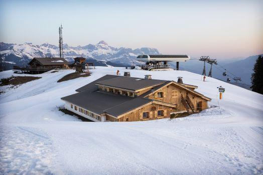

 </img>

L'équipe [SOLsTIS](https://mia-ps.inrae.fr/solstis) de l'unité MIA Paris Saclay organise en 2024 son workshop biannuel **Statistiques au sommet de Rochebrune** du 24 au 29 mars 2024. 

  

## Les participants 

Entre 30 et 40 participant(e)s, chercheur(e)s débutant(e)s ou confirmé(e)s se retrouvent tous les deux ans pour suivre un cours,  présenter leurs travaux en cours et en discuter, dans une ambiance chaleureuse et conviviale.  La participation se fait sur **invitation**. 

  

## Les organisateurs 

L'organisation originelle de ce workshop revient à [E. Parent](https://mia-ps.inrae.fr/eric-parent). Suite à son départ en retraite officiel, cette organisation est assurée cette année par [S. Donnet](https://mia-ps.inrae.fr/sophie-donnet) et [P. Gloguen](https://papayoun.github.io/). 

  

## Programme

 - Le programme  2024 est en cours d'élaboration. Le cours sera donné par [P. Barbillon](https://mia-ps.inrae.fr/pierre-barbillon). 
 - [Programme 2022](programme/programme_rochebrune_2022.pdf).  **Cours** par [D. Allard](https://biosp.mathnum.inrae.fr/homepage-denis-allard) , [T. Opitz](https://biosp.mathnum.inrae.fr/homepage-thomas-opitz) et [L. Clarotto](https://mia-ps.inrae.fr/lucia-clarotto).
 - Programme 2020 (cette édition a eu lieu en ligne en 2021)
 - [Programme 2018](programme/progroch2018.pdf)  **Cours** par ???
 - [Programme 2016](programme/) **Cours** par ???

Le programme  s'articule autour d'un cours de 3*2h. Tous les participants présentent leur travaux au cours d'un exposé d'une vingtaine de minutes. 
Les milieux d'après midi sont laissés libre afin de profiter des activités de montagne.

  

## Lieu 

Ce workshop a lieu dans un cadre exceptionnel, au [chalet de l'Asma](https://www.asma-nationale.fr/com/page/2817), qui se situe au sommet de Rochebrune (Megève). L'accès au chalet n'est possible QUE par le télécabine de Rochebrune. 

  

## Organisation

Le chalet est confortable mais rustiques. Les particpants sont hébergés en chambres de 2 à 5 personnes. 

